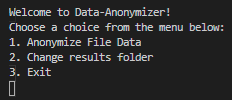
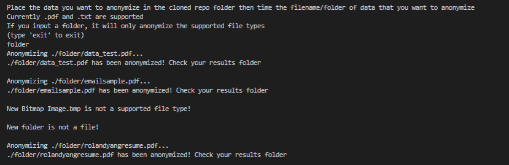
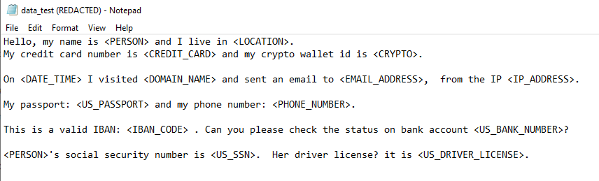
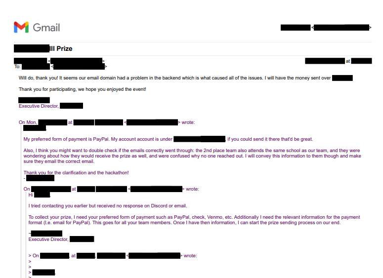

# pdf-anonymize
A python program that uses Microsoft's Presidio Project to anonymize txt and pdf files.

Supported PII Identities may be found here: https://microsoft.github.io/presidio/supported_entities/

Currently supports .pdf and .txt files only. Can anonymize data in bulk inside folders.

# Installation

Make a clone of the git repository

```bash
git clone https://github.com/whyroland/anonymize-pdf.git
```

cd into the the cloned repository on your computer

Run the following commands in the command line of your choice

```bash
pip install PyMuPDF
pip install presidio-analyzer
pip install presidio-anonymizer
python -m spacy download en_core_web_lg
```

# Usage

Run the script "anonymize.py" to use the program

```bash
python anonymize.py
```

**Place data you want to anonymize inside of the cloned repo folder and enter the file name to anonymize it**

# Screenshots








# Future Plans

- Train the Presidio Model to identify more PIIs
